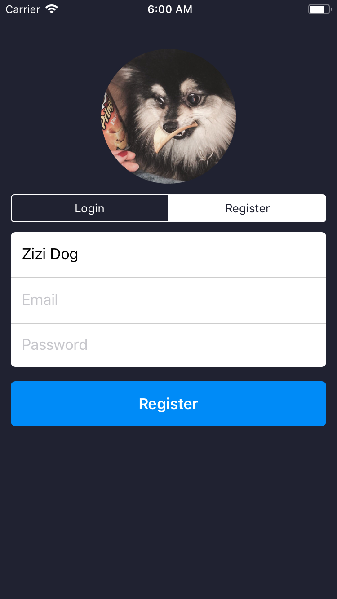
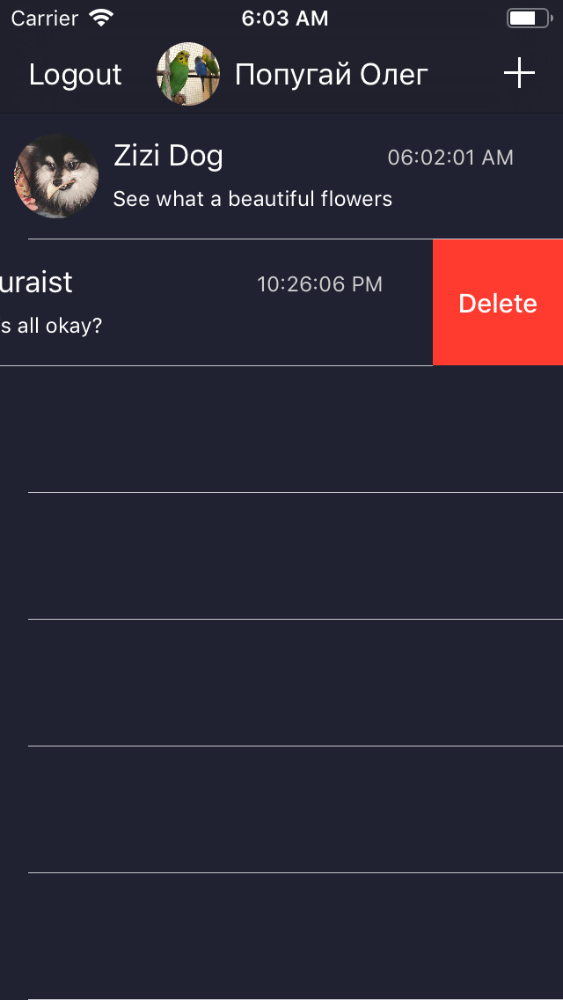
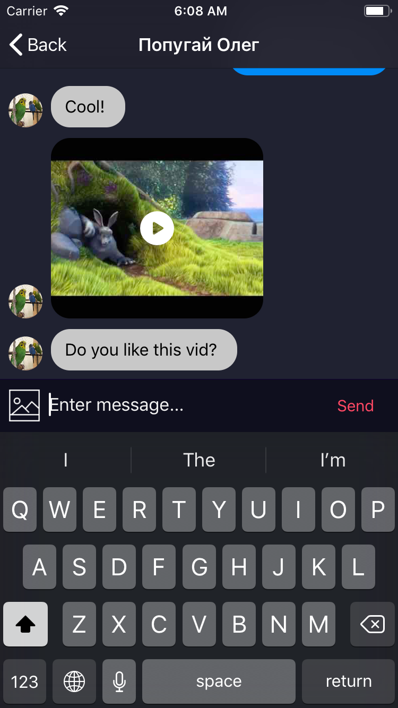

# Treedo Chat

The application is a real-time chat using Firebase.

It allows you send messages, images and videos to your friends. Just sign up, choose a buddy and start chatting.

### Sign Up or Login

You should enter a username, email and password and add your photo from the Camera Roll. 
Password is encrypted after signing up.

### Choose a Chat

You can continue an old conversation or start a new one by tapping the Plus button. 
If you don't need an ended dialog you can delete it.

### Chatting

Share messages, photos and videos and get them back from your buddies. 

